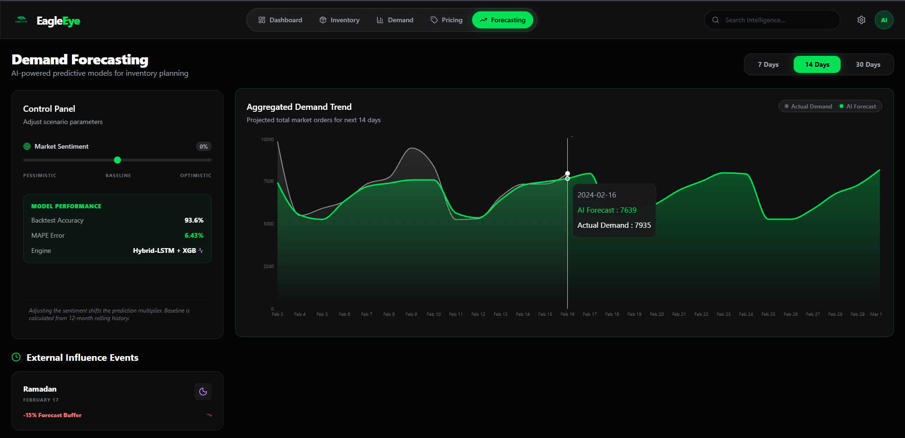
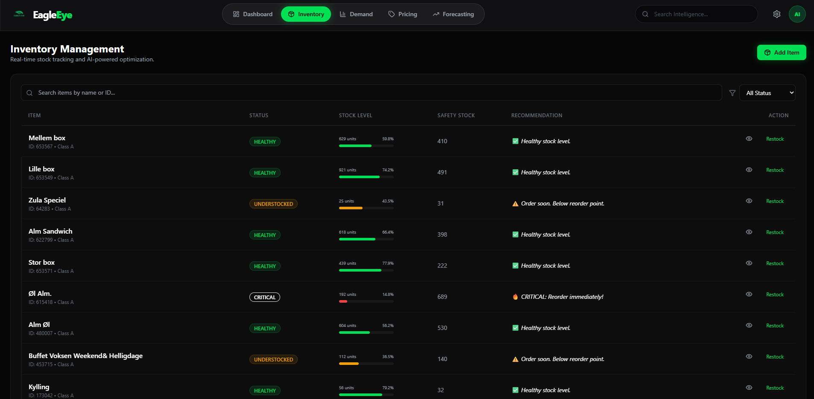
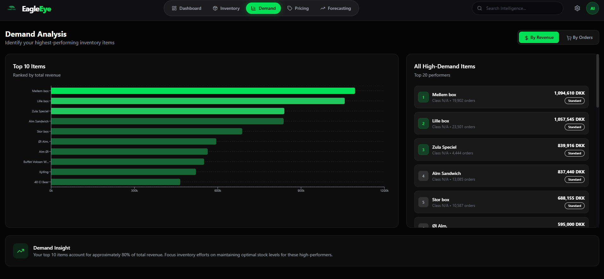
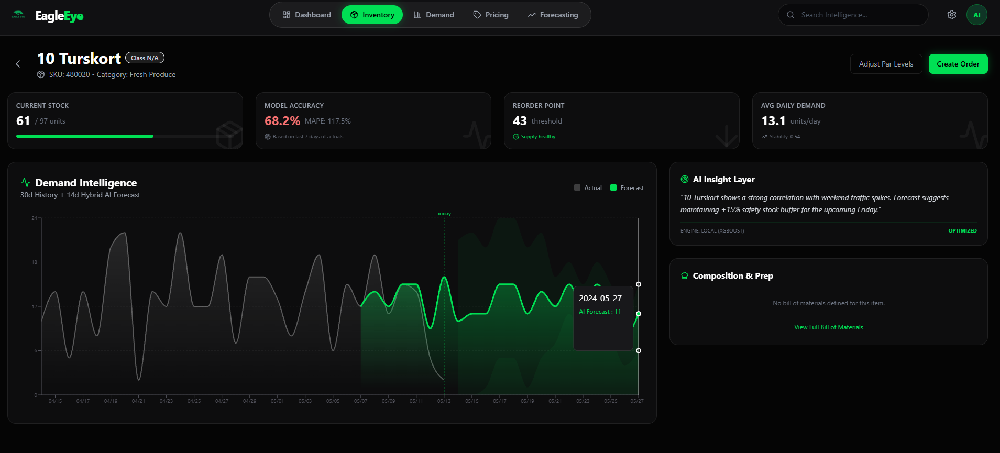
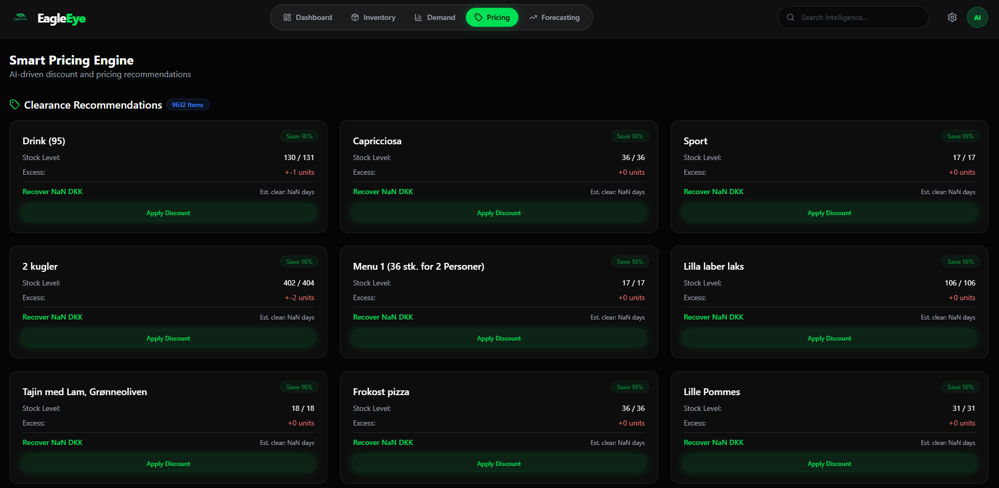
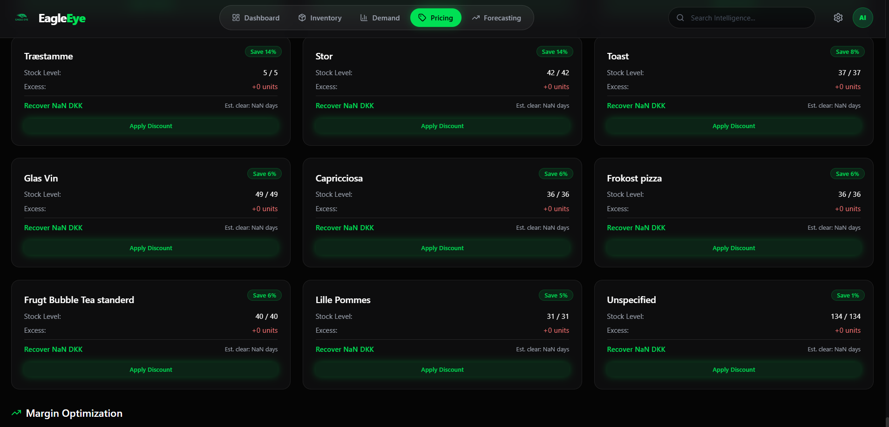
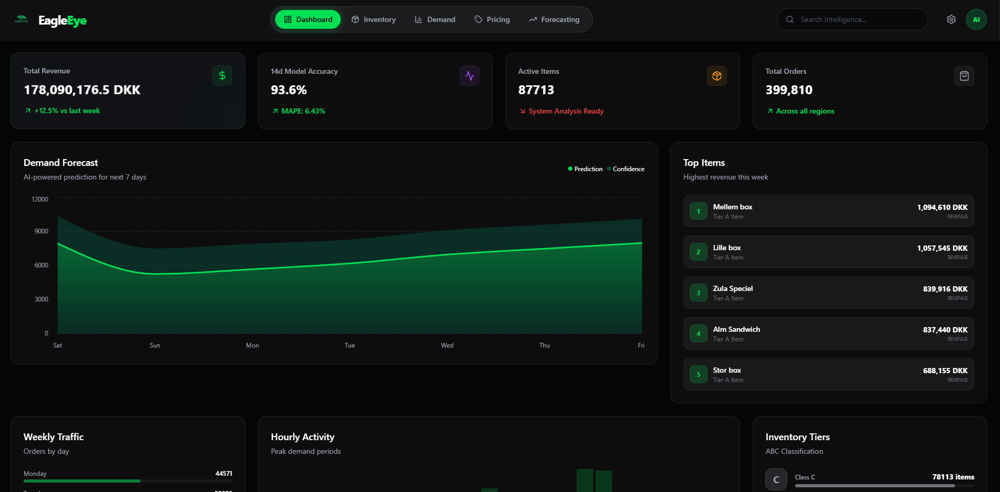

# EagleEye
<div align="center">
  
</div>

> **Deloitte x AUC Hackathon 2026** | Fresh Flow Markets Use Case

**EagleEye** is a comprehensive, AI-powered inventory management system designed for Fresh Flow Markets. It transforms reactive stock keeping into proactive demand intelligence, enabling businesses to minimize waste, prevent expensive stockouts, and maximize profitability through data-driven decisions.

By integrating advanced machine learning forecasting with real-time inventory tracking, EagleEye provides actionable insights that bridge the gap between historical sales data and future demand.

---

## Table of Contents

- [Features](#-features)
- [Technologies Used](#-technologies-used)
- [Installation](#-installation)
- [Usage](#-usage)
- [Architecture](#-architecture)
- [Team Members](#-team-members)
- [Contributing](#-contributing)
- [License](#-license)

---

## Features

EagleEye provides a holistic suite of tools for inventory optimization:

### 1. Demand Forecasting
ML-powered predictions for daily, weekly, and monthly demand using advanced models (XGBoost/Prophet).
> 
> *Dashboard showing predicted demand vs actual sales with confidence intervals.*

### 2. Intelligent Inventory Management
Automated reorder point calculations and safety stock recommendations based on variability and lead times.
> 
> *Real-time inventory tracking with status indicators (Healthy, Critical, Understocked).*

### 3. Demand Analysis
Identify your highest-performing items ("Stars") and underperformers to optimize your catalog.
> 
> *Top performing items analysis ranked by revenue and order volume.*

### 4. Per-Item Demand Analysis
Deep-dive into specific items with historical sales data, detailed forecasts, and ingredients breakdown (Bill of Materials).
> 
> *Detailed view of a single item's performance, forecast, and composition.*

### 5. Smart Alerts System
Instant notifications for high-priority issues such as stock checkouts, high demand variability, or expiration risks.
> 
> *Priority alerts for immediate action.*

### 6. Dynamic Pricing Engine
Automated discount recommendations for overstocked items, calculated based on utilization rates and predicted demand to maximize revenue while clearing inventory.
> 
> *AI-driven discount optimization.*

### 7. Insightful Analytics
Comprehensive dashboards tracking revenue, order volume, and model accuracy metrics (MAPE).
> 
> *High-level KPIs and business health metrics.*

---

## Technologies Used

### Backend
*   **Python 3.12+**: Core logic and API handling.
*   **FastAPI**: High-performance, modern web framework for building APIs.
*   **Pandas / Polars**: Efficient data manipulation and analysis.
*   **XGBoost / Prophet**: State-of-the-art machine learning models for time-series forecasting.
*   **DuckDB**: In-process SQL OLAP database for analytical queries.

### Frontend
*   **React 19 (via Vite)**: Fast, modern UI library.
*   **Tailwind CSS**: Utility-first CSS framework for rapid UI development.
*   **Recharts**: Composable charting library for React.
*   **Lucide React**: Beautiful, consistent icons.
*   **Framer Motion**: Production-ready animation library.

### Analytics & DevTools
*   **Jupyter Notebooks**: For exploratory data analysis (EDA).
*   **Git LFS**: Managing large datasets.
*   **Pytest**: Robust testing framework.

---

## Installation

Follow these steps to set up the project locally.

### Prerequisites
*   Python 3.12 or higher
*   Node.js 20 or higher
*   Git (with LFS support)

### Step-by-Step Guide

1.  **Clone the Repository**
    ```bash
    git clone https://github.com/GM-Sniper/EagleEye.git
    cd EagleEye
    ```

2.  **Download Data (Git LFS)**
    ```bash
    git lfs pull
    ```

3.  **Backend Setup**
    ```bash
    # Create virtual environment
    python -m venv venv
    
    # Activate virtual environment
    # Windows:
    venv\Scripts\activate
    # Mac/Linux:
    # source venv/bin/activate

    # Install Python dependencies
    pip install -r requirements.txt
    ```

4.  **Frontend Setup**
    ```bash
    cd src/frontend
    npm install
    cd ../..
    ```

---

## Usage

### 1. Start the Backend API
Run the FastAPI server from the project root:
```bash
uvicorn src.api:app --reload --port 8000
```
The API documentation will be available at: [http://localhost:8000/docs](http://localhost:8000/docs)

### 2. Start the Frontend Application
In a new terminal, navigate to the frontend directory and start the dev server:
```bash
cd src/frontend
npm run dev
```
Access the application at: [http://localhost:5173](http://localhost:5173)

---

## Architecture

The project follows a modular micro-service style architecture:

```
EagleEye/
├── Data/                       # Raw and processed datasets (Git LFS)
│   ├── dim_*.csv               # Dimension tables (items, users, etc.)
│   └── fct_*.csv               # Fact tables (orders, transactions)
├── src/
│   ├── api.py                  # Main FastAPI application entry point
│   ├── models/                 # ML Forecasting models (Prophet, XGBoost, etc.)
│   │   ├── hybrid_forecaster.py
│   │   └── production_forecaster.py
│   ├── services/               # Business logic layer
│   │   ├── data_pipeline.py    # Data ingestion and processing
│   │   ├── inventory_service.py # Inventory optimization logic
│   │   └── menu_analytics_service.py
│   ├── frontend/               # React Frontend Application
│   │   ├── src/
│   │   │   ├── pages/          # Application Routes (Dashboard, Inventory, Demand)
│   │   │   ├── components/     # Reusable UI Components
│   │   │   └── services/       # API integration
│   │   └── package.json
│   └── analysis.ipynb          # EDA Notebooks
├── requirements.txt            # Python dependencies
└── README.md                   # Project documentation
```

---

## Team Members

| Name | Role | Contribution % | Contributions |
|------|------|:--------------:|---------------|
| **Seif Elansary** | Data Analyst | 20% | Exploratory data analysis, data cleaning, and visualization |
| **Marwan Abudaif** | AI Engineer | 20% | Developing and tuning XGBoost and Prophet models |
| **Ramy Shehata** | Frontend Developer | 20% | UI/UX design, React components, and dashboard implementation |
| **Mostafa Gaafer** | Backend Developer | 20% | FastAPI architecture and API endpoints |
| **Noor Emam** | Integration Engineer | 20% | Connecting frontend to backend, system testing, and deployment |


---

## Contributing

We welcome contributions! Please see our [Contributing Guide](CONTRIBUTING.md) for details on our git workflow, code style, and submission process.

---

## License

This project was created for the Deloitte x AUC Hackathon 2026.
